## cwal

<p align="center">
  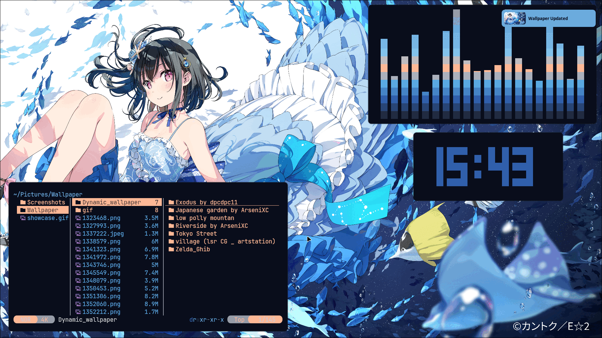
</p>

`cwal` is a fast and lightweight command-line tool for generating dynamic color schemes from images. It extracts dominant colors from your chosen image and applies them to your terminal, applications, and other system components, providing a cohesive and visually appealing desktop experience.


## ✨ Features

- **Dynamic Color Generation**: Extracts a vibrant 16-color palette from any image
- **Advanced Backend Support**: Utilizes `imagemagick` or `libimagequant` for efficient color quantization
- **Extensive Customization**: Fine-tune saturation, contrast, alpha transparency, and theme mode (dark/light)
- **Template-Based Output**: Generates color schemes for various applications using customizable templates
- **Automatic Application Reloading**: Seamlessly integrates with your system to apply changes instantly
- **Palette Preview**: View the generated color palette directly in your terminal
- **Random Image Selection**: Automatically pick a random image from any specified directory


## 🖼️ Showcase

- Dark mode
<p align="center">
  
  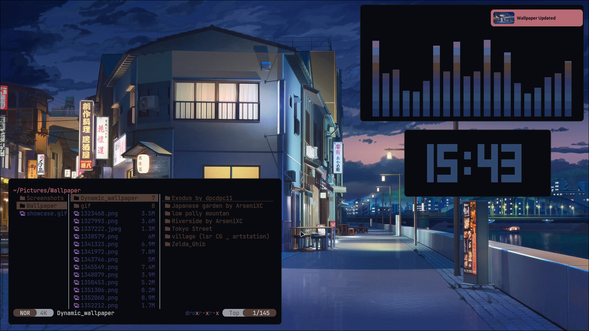
  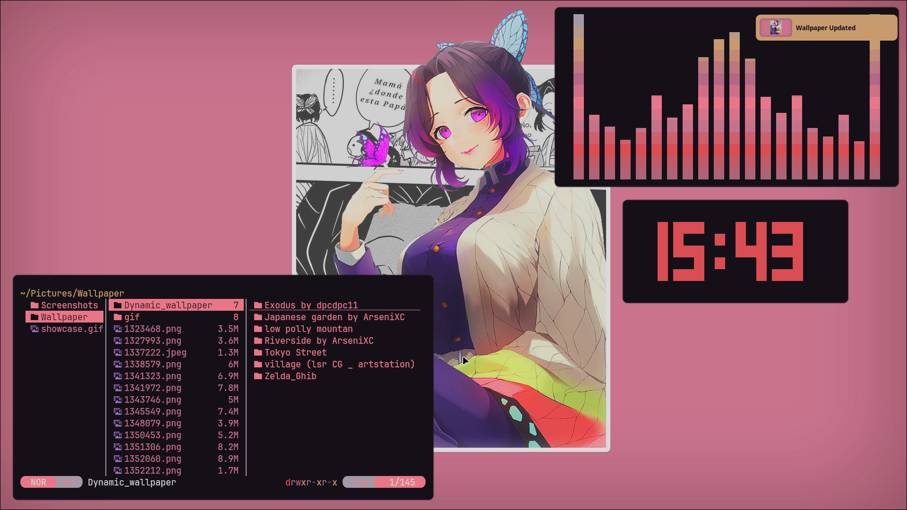
</p>
<p align="center">
  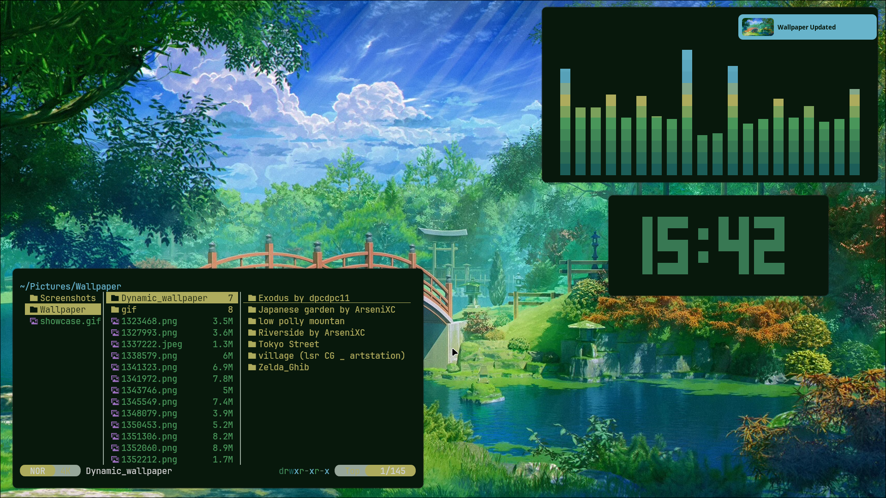
  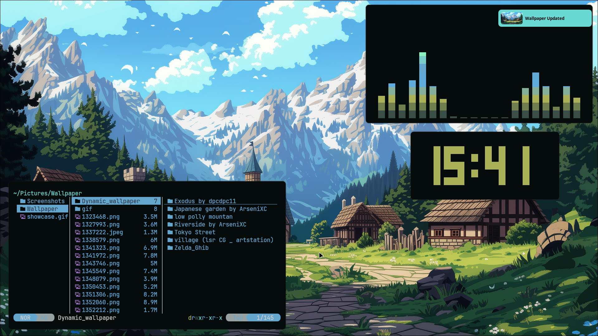
  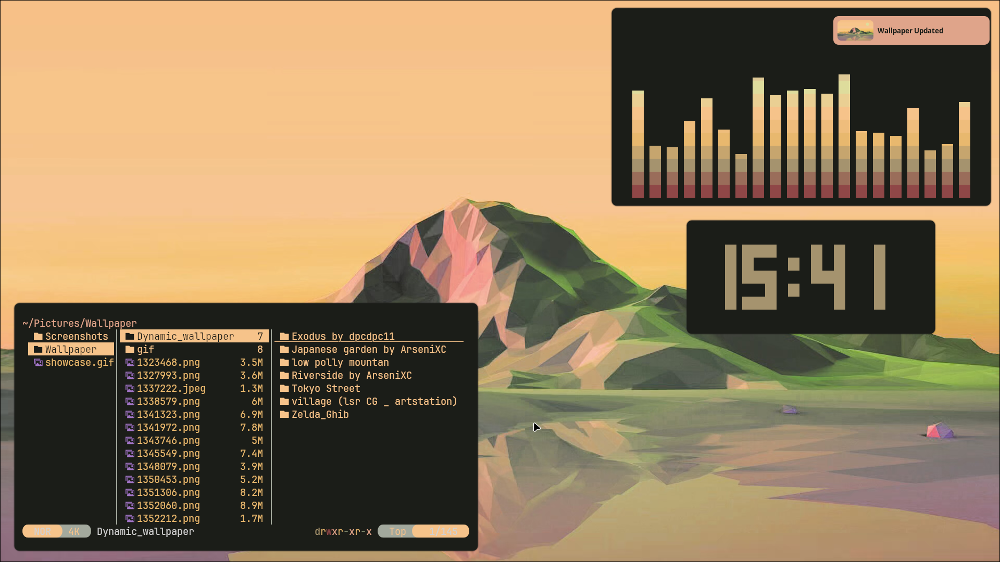
</p>

- Light mode
<p align="center">
  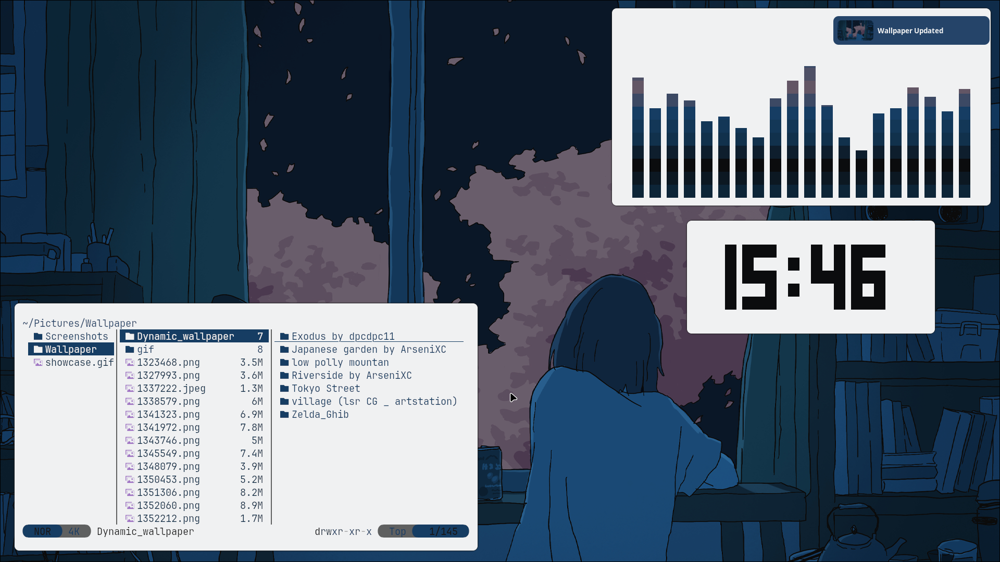
  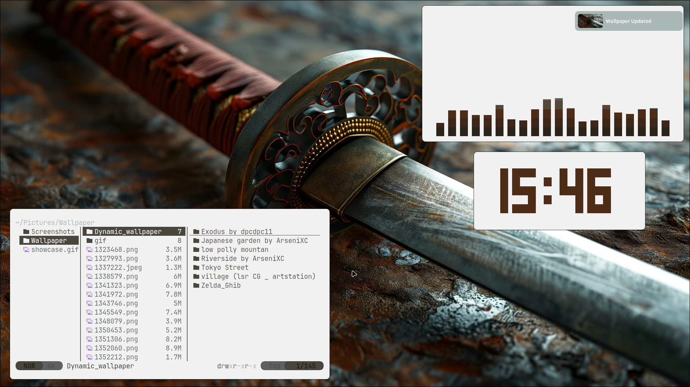
  
</p>
<p align="center">
  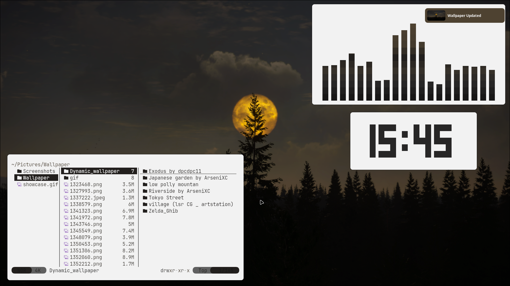
  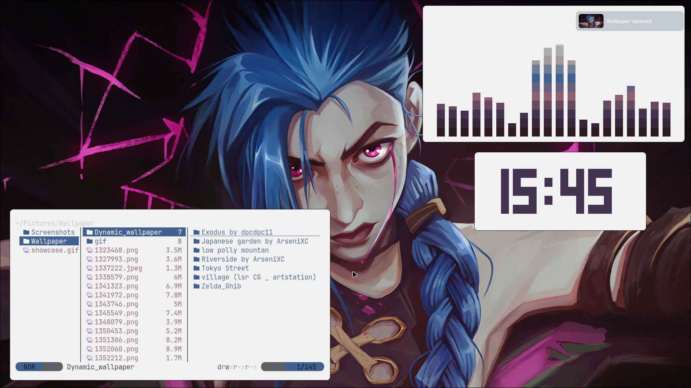
  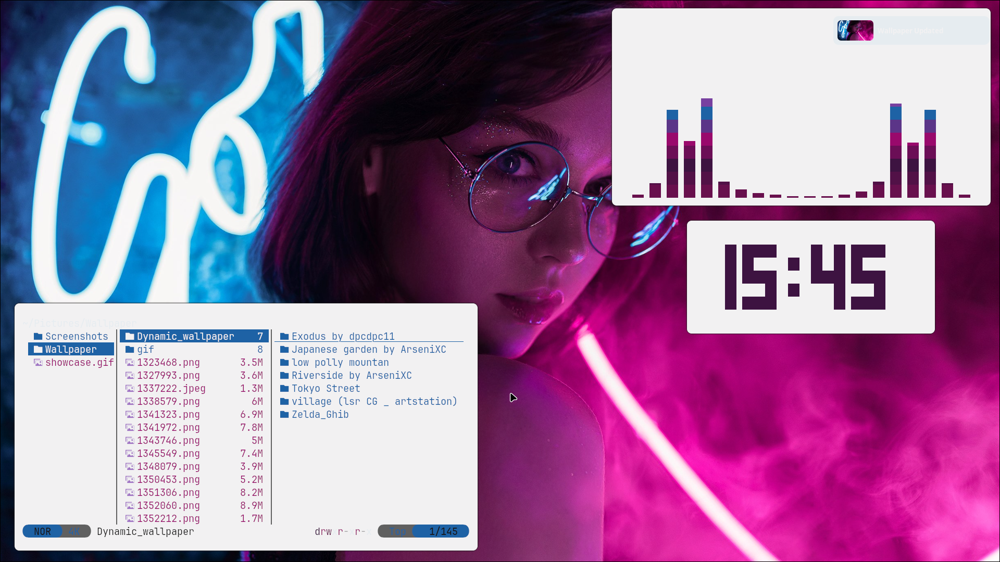
</p>


## 🚀 Installation

`cwal` requires `imagemagick` and `libimagequant` as dependencies.


### Prerequisites

Ensure the following libraries are installed on your system:

- `imagemagick`
- `libimagequant`

**Ubuntu/Debian:**

```bash
sudo apt install imagemagick libimagequant-dev
```

**Arch Linux:**

```bash
sudo pacman -S imagemagick libimagequant
```

**Fedora/RHEL:**

```bash
sudo dnf install ImageMagick-devel libimagequant-devel
```


### Arch Linux (AUR)

Install directly from the AUR:

```bash
yay -S cwal
# or
paru -S cwal
```


### Building from Source

1. **Clone the repository:**

```bash
git clone https://github.com/nitinbhat972/cwal.git
cd cwal
```

2. **Build and install:**

*User-specific:*

```bash
mkdir build && cd build
cmake -DCMAKE_INSTALL_PREFIX=$HOME/.local ..
make
make install
```

*System-wide:*

```bash
mkdir build && cd build
cmake ..
make
sudo make install
```

## 💡 Usage

```bash
Usage: cwal [OPTIONS] --img <image_path>
```

- `--img <image_path>`                 Specify the image path (required)
- `--mode <dark|light>`                 Set theme mode
- `--cols16-mode <darken|lighten>`      Set 16-color mode
- `--saturation <float>`                Overall saturation
- `--contrast <float>`                  Contrast ratio
- `--alpha <float>`                     Alpha transparency (0.0-1.0)
- `--out-dir <path>`                    Output directory for generated files
- `--backend <name>`                    Set image processing backend
- `--script <script_path>`              Run custom script after processing
- `--no-reload`                         Disable reloading
- `--list-backends`                     List available backends
- `--quiet`                             Suppress all output
- `--random <directory>`                Select random image from directory
- `--preview`                           Preview palette
- `--help`                              Help

**Examples:**

```bash
cwal --img /path/to/image.jpg
cwal --img /path/to/image.png --mode dark --saturation 0.2
cwal --img /path/to/image.jpg --preview
cwal --random ~/Pictures/wallpapers
cwal --img /path/to/image.jpg --out-dir ~/.config/colors --script ~/.local/bin/reload-apps.sh
```


## 🎨 Templates

Templates are stored in:

- `/usr/local/share/cwal/templates` (system-wide)
- `~/.config/cwal/templates` (user)

**Supported apps:**
Terminal emulators (Alacritty, Kitty, Wezterm), window managers (i3, bspwm, Hyprland), text editors (Vim, Neovim, VS Code), system themes (GTK, Qt).

## 🔧 Advanced Usage

- Check available backends: `cwal --list-backends`
- Choose backend: `cwal --img image.jpg --backend libimagequant`
- Post-process: `cwal --img image.jpg --script ~/.local/bin/update-theme.sh`
- Batch processing:

```bash
for img in ~/Pictures/wallpapers/*.{jpg,png,jpeg}; do
    cwal --img "$img" --quiet
done
```


## 🤝 Contributing

Report issues, request features, or contribute via PRs. See the GitHub repository for more info.

## 📄 License

Licensed under GNU GPL v3.0 — always free and open-source.

**Star the project on GitHub if you find it useful!**


## Special Thanks

- [pywal](https://github.com/dylanaraps/pywal) by [dylanaraps](https://github.com/dylanaraps)

- [pywal16](https://github.com/eylles/pywal16) by [eylles](https://github.com/eylles)

